# Table of contents

1. [Introduction](#introduction)
2. [Get started](#get-started)
3. [Create project](#create-project)
    1. [Project configuration](#project-configuration)
    2. [Create lesson](#create-lesson)
    3. [Some tips](#some-tips)
4. [Testing](#testing)
    1. [Preparation](#preparation)
    2. [Create test](#create-test)

# Introduction

This is a guide on how to create a HyperSkill project using Kotlin and Ktor. We will create a HyperSkill course, import
Kotlin and Ktor, and learn how to test applications. Let's get started!

# Get started

To create a project with the EduTools plugin, you need
to [download IntelliJ IDEA Edu](https://www.jetbrains.com/education/download/). This version already contains the
installed version of the EduTools plugin, so you can get started right away.

If you already have a regular installation of IntelliJ IDEA installed, you can download
the [EduTools](https://plugins.jetbrains.com/plugin/10081-edutools) plugin from Marketplace.

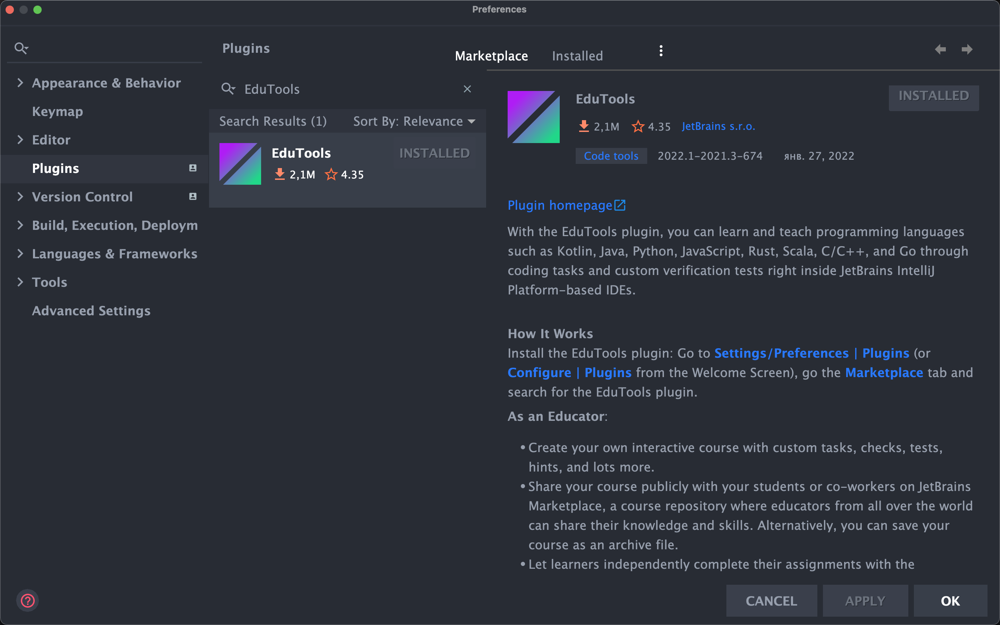<br>
After that, make sure you have enabled EduTools project creating features:

Click `Help` -> `Enable Course Creator Features`

You will also need a [Kotlin](https://plugins.jetbrains.com/plugin/6954-kotlin) plugin. Make sure that it is installed
and enabled.

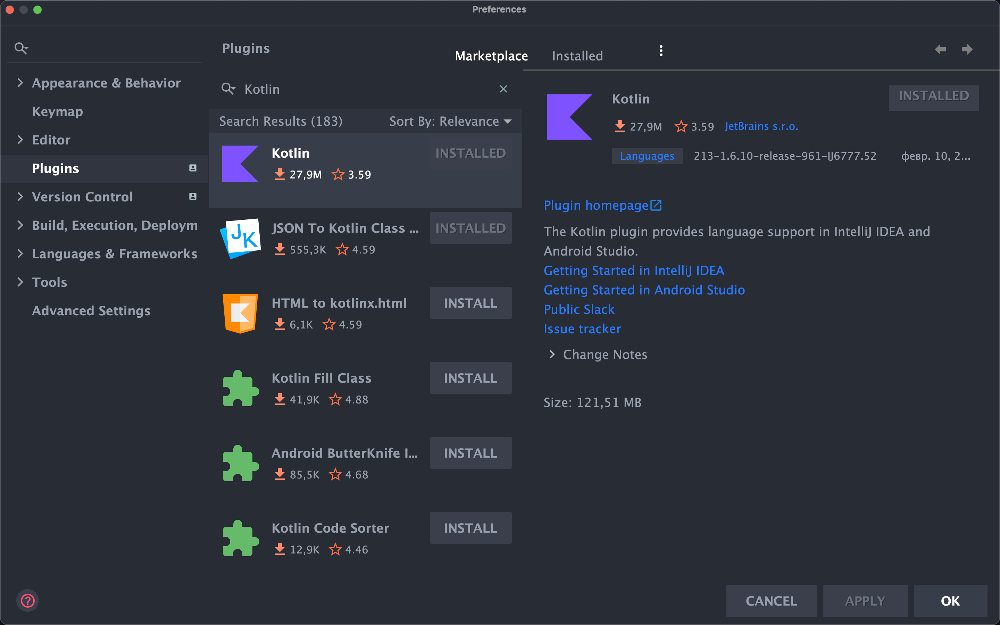<br>

# Create project

To create a project, you need to click `File -> Learn and Teach -> Create New Course`

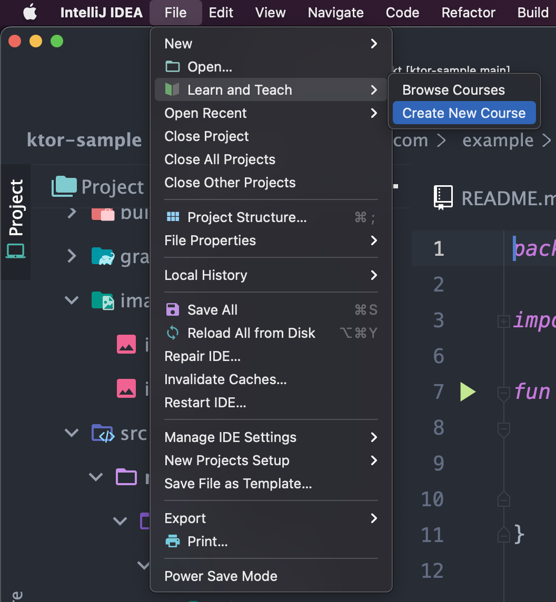<br>

Set the title, select `Kotlin` language and click `Create`.

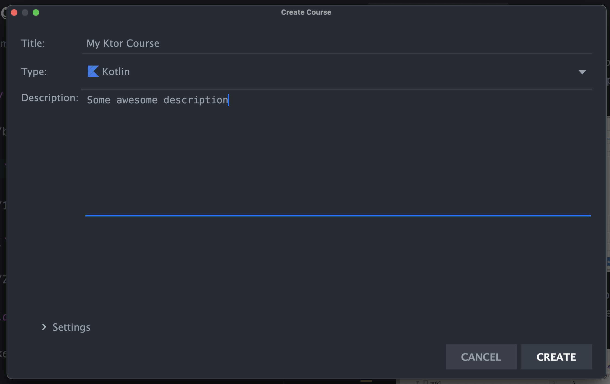<br>

This is how your project should look like for now. Please, don't touch `.yaml` files - they are internal for the
EduTools plugin.

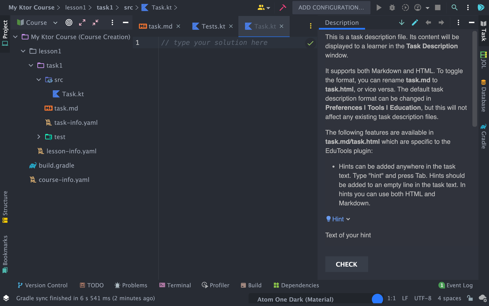<br>

## Project configuration

Next, you need to delete `lesson1`. You should end up with a single file `build.gradle`. Now let's configure our
project. Replace the contents of `build.gradle` file with what is given below.

<details>
<summary><code>build.gradle</code></summary>

```groovy
buildscript {
    apply plugin: 'hyperskill'

    repositories {
        mavenCentral()
    }
    dependencies {
        classpath "org.jetbrains.kotlin:kotlin-gradle-plugin:$hs.kotlin.version"
    }
}

subprojects {
    apply plugin: 'application'
    apply plugin: 'java'
    apply plugin: 'kotlin'
    apply plugin: 'hyperskill'

    def userJava = Integer.parseInt(JavaVersion.current().getMajorVersion())
    def hsJava = Integer.parseInt(hs.kotlin.javaVersion)
    def testJava = Math.max(userJava, hsJava)

    java.toolchain.languageVersion = JavaLanguageVersion.of(testJava)

    compileJava {
        javaCompiler = javaToolchains.compilerFor {
            languageVersion = JavaLanguageVersion.of(userJava)
        }
    }

    compileTestJava {
        javaCompiler = javaToolchains.compilerFor {
            languageVersion = JavaLanguageVersion.of(testJava)
        }
    }

    repositories {
        mavenCentral()
        maven { url "https://jitpack.io" }
    }

    dependencies {
        testImplementation 'com.github.hyperskill:hs-test:release-SNAPSHOT'
    }

    configurations.all {
        resolutionStrategy.cacheChangingModulesFor 0, 'seconds'
    }

    sourceSets {
        main.java.srcDir 'src'
        test.java.srcDir 'test'
    }

    test {
        systemProperty "file.encoding", "utf-8"
        outputs.upToDateWhen { false }
    }

    compileJava.options.encoding = 'utf-8'
    tasks.withType(JavaCompile) {
        options.encoding = 'utf-8'
    }
}

project(':util') {
    dependencies {
        implementation 'com.github.hyperskill:hs-test:release-SNAPSHOT'
    }
}

configure(subprojects.findAll { it.name != 'util' }) {
    dependencies {
        testImplementation project(':util').sourceSets.main.output
        testImplementation project(':util').sourceSets.test.output
    }
}

wrapper {
    gradleVersion = hs.gradle.version
}
```

</details>


Notice dependency `testImplementation 'com.github.hyperskill:hs-test:release-SNAPSHOT'` - it's this `hs-test` library.
This dependency points to the latest commit of the `release` branch so the EduTools plugin will download relevant
version of the library every time a user starts a project. The
part `configurations.all { resolutionStrategy.cacheChangingModulesFor 0, 'seconds' }` will ensure that Gradle will
update the library on the user side after every commit to the `release` immediately. If you want to use the latest
features (or you're just trying to fix a bug) use `master` branch. But keep in mind, that every project on Hyperskill
uses `release` branch.

Notice the usage of `apply plugin: 'hyperskill'` and Java/Kotlin/Gradle version dependencies not hardcoded, but actually
hidden behind variables `hs.java.version`, `java.gradle.version` e.t.c. They are defined
in [hs-gradle-plugin repo](https://github.com/hyperskill/hs-gradle-plugin) and are updated there so that we don't have
to update every project on Hyperskill separately in case we want to update Java/Kotlin/Gradle.

Also, you should change default `settings.gradle` generated by EduTools plugin. You can't see it when you generate new
EduTools project, but it is actually there. To find it, change your project view from `Course` to `Project` and you will
see `settings.gradle` here in the project.

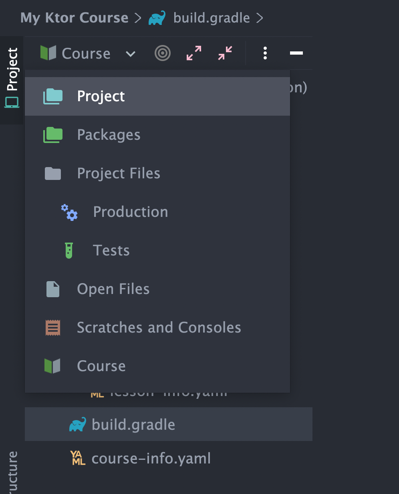<br>

Here's `settings.gradle` you should use in your project:

<details>
<summary><code>settings.gradle</code></summary>

```groovy
buildscript {
    repositories {
        maven { url 'https://jitpack.io' }
    }

    dependencies {
        classpath "com.github.hyperskill:hs-gradle-plugin:release-SNAPSHOT"
    }

    configurations.all {
        resolutionStrategy.cacheChangingModulesFor 0, 'seconds'
    }
}

static String sanitizeName(String name) {
    return name.replaceAll("[ /\\\\:<>\"?*|()]", "_").replaceAll("(^[.]+)|([.]+\$)", "")
}

rootProject.projectDir.eachDirRecurse {
    if (!isTaskDir(it) || it.path.contains(".idea")) {
        return
    }
    def taskRelativePath = rootDir.toPath().relativize(it.toPath())
    def parts = []
    for (name in taskRelativePath) {
        parts.add(sanitizeName(name.toString()))
    }
    def moduleName = parts.join("-")
    include "$moduleName"
    project(":$moduleName").projectDir = it
}

def isTaskDir(File dir) {
    return new File(dir, "src").exists() || new File(dir, "test").exists()
}

include 'util'
```

</details>

As you can see, in `buildscript` block script imports `hyperskill` plugin to be visible in `build.gradle`. As with
the `hs-test` library, this dependency linked
with [hs-gradle-plugin repo](https://github.com/hyperskill/hs-gradle-plugin) and tied to the `release` branch. So,
whenever we want to update the dependencies in every project we just do 1 commit to this repository.

## Create lesson

Then, you should create a so-called `Framework Lesson` and give it a name like a project name. For this, you need to
create a new `Lesson`(right-click on the project folder) and choose `Framework lesson` in the dialog.

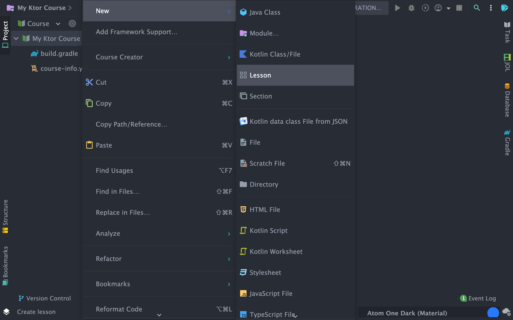<br>

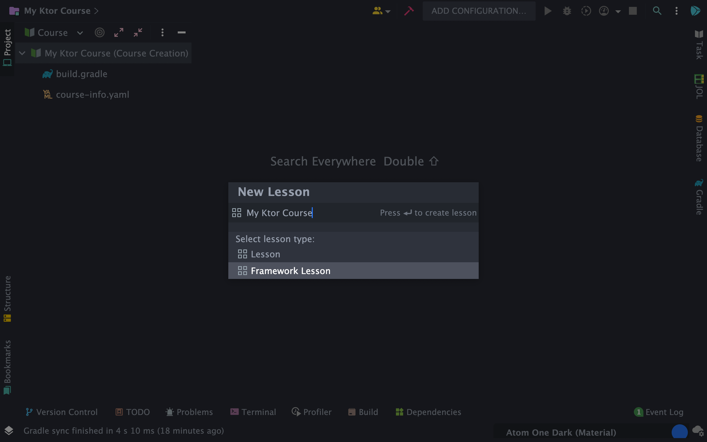<br>

Then, you should create a new `Task` inside this `Framework Lesson` and give it the name `stage1`. The task type should
be `Edu`.

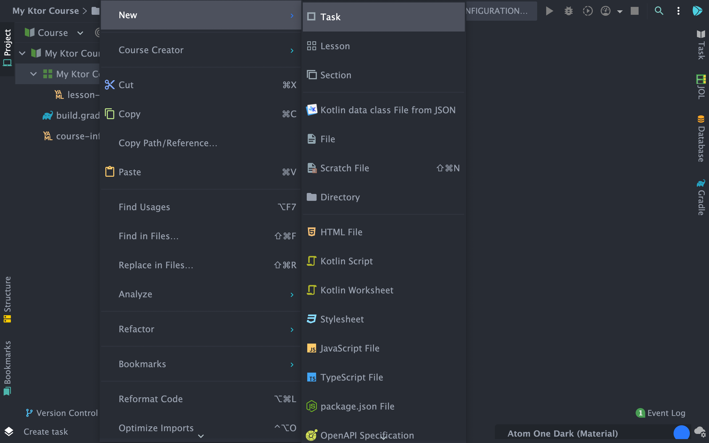<br>

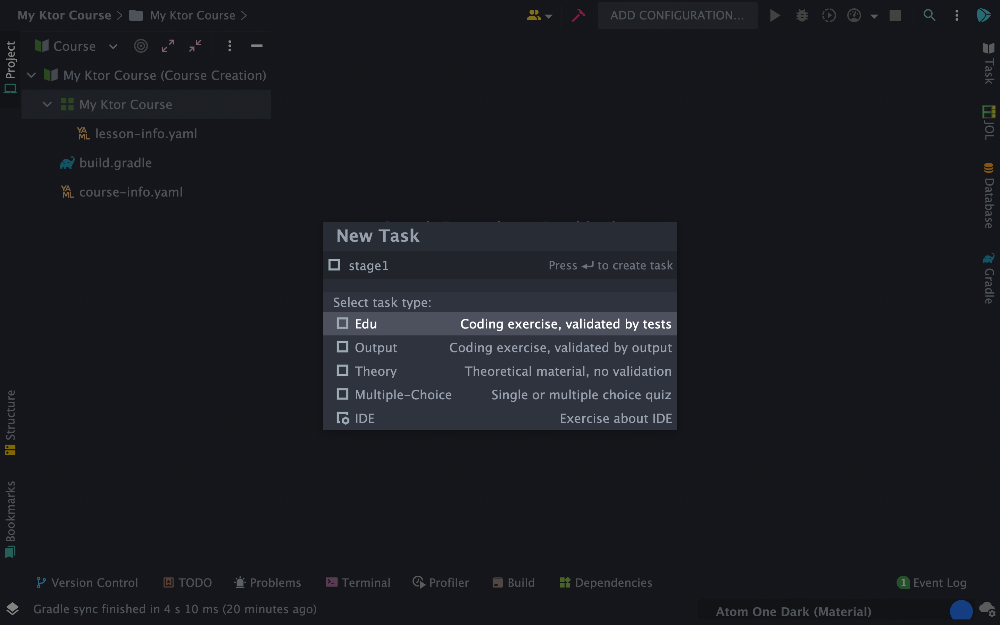<br>

Then remove `src/Task.java` and `test/Tests.java`, create package `src/myktorcourse`, create
file `src/myktorcourse/Application.kt`
, create file `test/MyKtorCourseTest.kt`.

Notice, that you need to name folder and file appropriately your project theme, don't stick to `My Ktor Course`. This is
just an example. You should end up with this configuration:

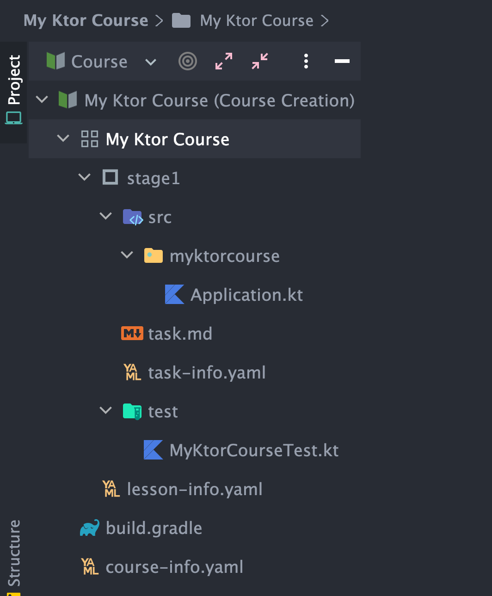<br>

Also, we need to configure our stage module. To import Ktor to our project we need to create `build.gradle` file in
every `stage` folder and configure it. For example, you can use this setup for Ktor project:

<details>
<summary><code>build.gradle</code></summary>

```groovy
buildscript {
    repositories {
        mavenCentral()
    }
}

apply plugin: 'java'
apply plugin: 'org.jetbrains.kotlin.jvm'
version '1.0-SNAPSHOT'

repositories {
    mavenCentral()
}
sourceSets.main.resources.srcDirs = ["src/resources"]

dependencies {
    implementation "org.jetbrains.kotlin:kotlin-stdlib"
    implementation "io.ktor:ktor-server-core:1.6.7"
    implementation "io.ktor:ktor-server-netty:1.6.7"
    implementation("ch.qos.logback:logback-classic:1.2.10")
}
```

</details>

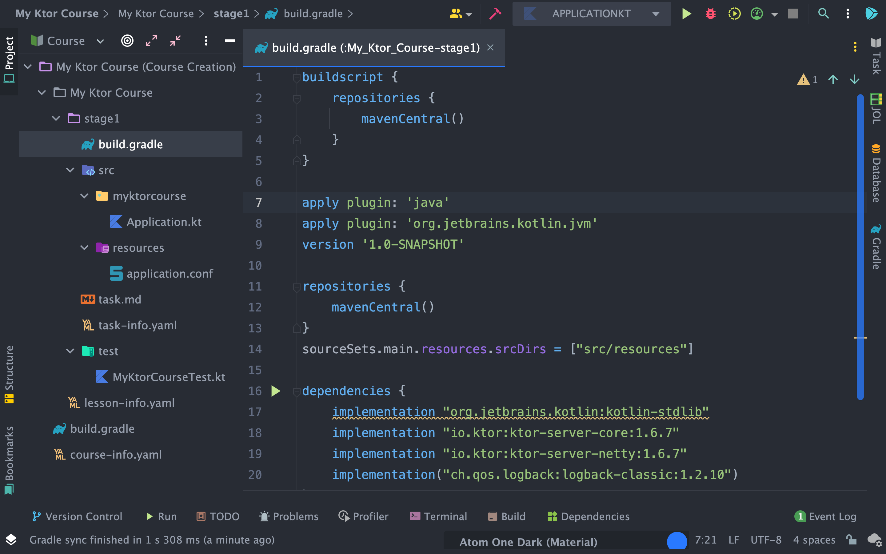<br>

To create tests for the second stage, click on `Framework Lesson` named `My Ktor Course` and add a new `Task`. Name
it `stage2`. Your result should look like the following:

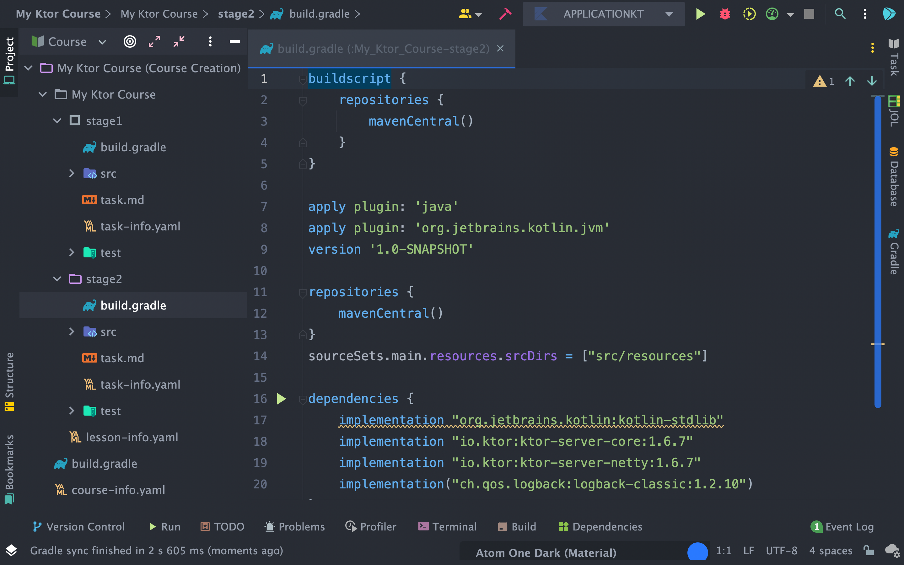<br>

Notice that in `stage2` also created `build.gradle` with Ktor settings and `Application.kt` files by default. That's why
you don't have to create it every time.

## Some tips

If you see `(excluded)` near your files, please right-click on this file and click `Course Creator`
-> `Include into Task` to include this file into the project.

Also, if you don't want some files to be seen by a user, you can hide them. It is especially useful when you're
including tests into the project, and they are added as visible files by default, so you should hide them as well.

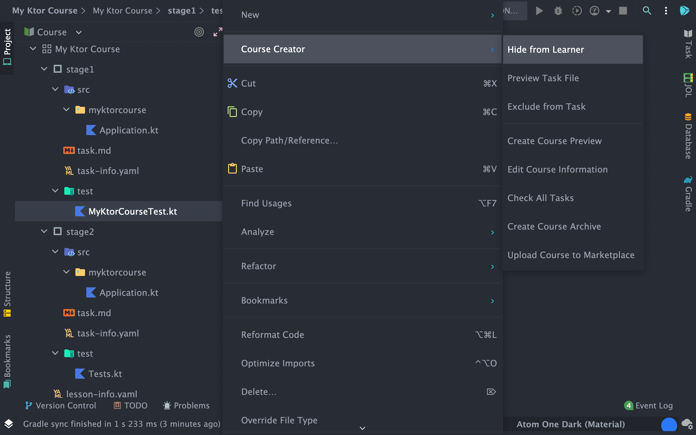<br>

You created an initial setup and ready to write tests!

# Testing

## Preparation

First, let's create simple Ktor server for testing. For example:

<details>
<summary><code>Application.kt</code></summary>

```kotlin
import io.ktor.application.*
import io.ktor.response.*
import io.ktor.routing.*

fun main(args: Array<String>): Unit = io.ktor.server.netty.EngineMain.main(args)

fun Application.module(testing: Boolean = false) {
    routing {
        get("/") {
            call.respondText("Hello, world!")
        }
    }
}
```

</details>

Note that for testing, it's better to create a server with a module function.

Also, you need to create `src/resources` folder with `application.conf` file. For example:

<details>
<summary><code>application.conf</code></summary>

```kotlin
ktor {
    deployment {
        port = 8080
    }
    application {
        modules = [myktorcourse.ApplicationKt.module]
    }
}
```

</details>

## Create test

The project will be tested using Hyperskill and Ktor testing tools. So you need to add next dependency to `build.gradle`
in `stage` folder.

```groovy
testImplementation "io.ktor:ktor-server-test-host:1.6.7"
```

Now you are ready to create tests. Below is an initial example of the `MyKtorCourseTest.kt` file, which checks the
server response (read more about Ktor testing [here](https://ktor.io/docs/testing.html)). Notice, that you don't need
the user's class at all - the library will find the main method across all user's classes automatically.
<details>

<summary><code>MyKtorCourseTest.kt</code></summary>

```kotlin

import io.ktor.http.*
import io.ktor.server.testing.*
import myktorcourse.module
import org.hyperskill.hstest.dynamic.DynamicTest
import org.hyperskill.hstest.stage.StageTest
import org.hyperskill.hstest.testcase.CheckResult

class MyKtorCourseTest : StageTest<Any>() {
    @DynamicTest
    fun test(): CheckResult {
        var result: CheckResult = CheckResult.correct();
        withTestApplication(Application::module) {
            handleRequest(HttpMethod.Get, "/").apply {
                if (response.status() != HttpStatusCode.OK)
                    result = CheckResult.wrong("Wrong status!")
                if (!response.content.equals("Hello, world!"))
                    result = CheckResult.wrong("Wrong content!")
            }
        }
        return result;
    }
}
```

</details>